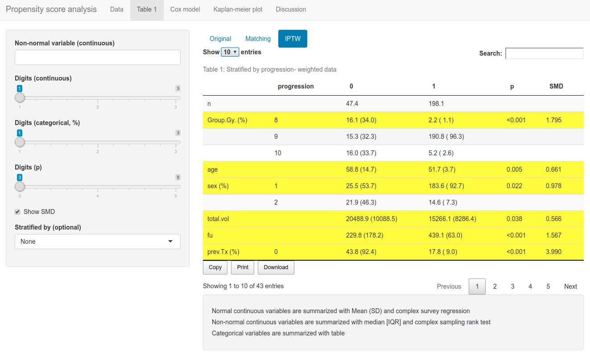

# Introduce RStudio Addins in jsmodule

## Install

``` r
remotes::install_github('jinseob2kim/jsmodule')
```

## RStudio Addins

### Basic statistics

``` r
jsBasicGadget(mtcars)
```


### Repeated measure analysis

``` r
jsRepeatedGadget(mtcars)
```

### Survey data analysis

``` r
library(survey)
data(api)
jsSurveyGadget(apistrat)
```

### Propensity score analysis(experimental)

``` r
jsPropensityGadget(mtcars)
```



## Web applications

- <https://openstat.ai>
