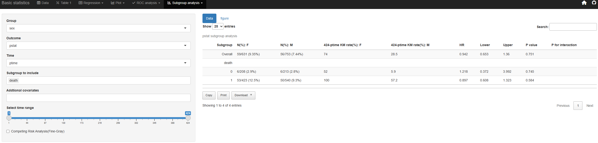
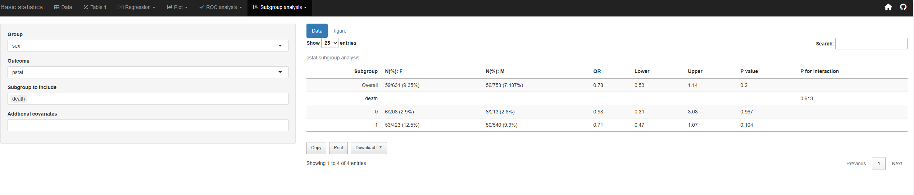
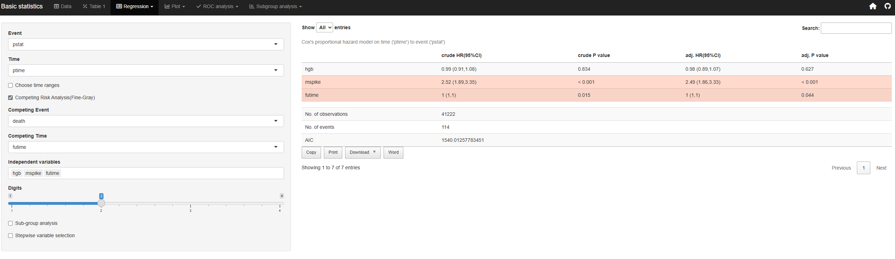
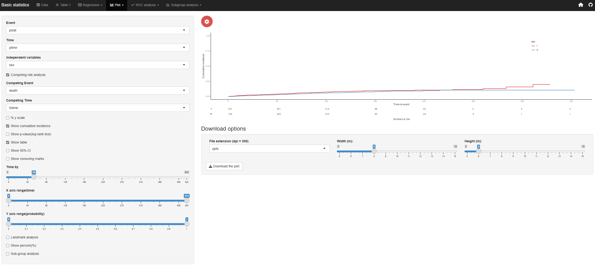

# Introducing Basic statistics of jsmodule

## Subgroup Analysis

### Subgroup analysis for Cox regression is available by selecting the event, time, group, and subgroup variables.

### Subgroup analysis for linear regression is available by selecting the group, outcome, and subgroup variables.

### Subgroup analysis for logistic regression is available by selecting the group, outcome, and subgroup variables.

## Competing risk analysis

### Competing risk analysis can be performed by selecting the regression tab and choosing the Cox model. After clicking on “Competing Risk Analysis,” select the competing risk and competing time variables to display results using the Fine-Gray method

### Kaplan-Meier plots are also available with competing risks reflected. After clicking on “Competing Risk Analysis,” select the competing risk and competing time variables to generate Kaplan-Meier plots that account for competing risks.

### Subgroup analysis for Cox regression with competing risks is also available. After clicking on “Competing Risk Analysis,” select the competing risk and competing time variables to generate Kaplan-Meier plots that account for competing risks.

## Web applications

- <https://openstat.ai>
